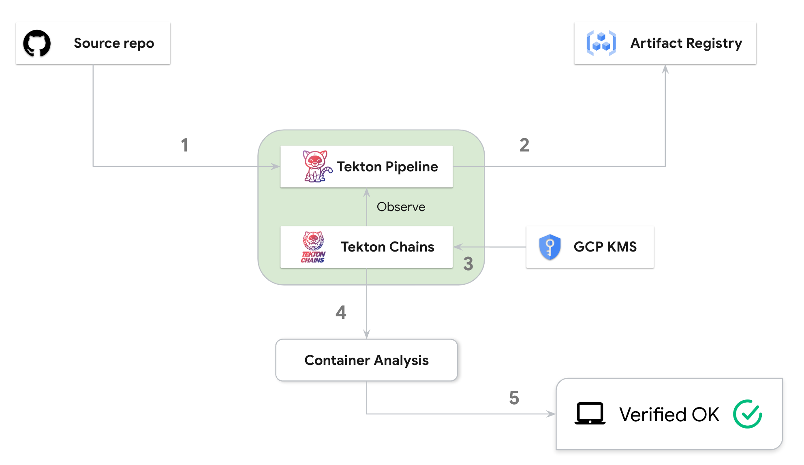

# CDF SIG Software Supply Chain (2022-12-08)

## Goal

The goal of this demo is to show how to manage software supply chain security with Tekton stack and some GCP services.

## Demo
The following diagram shows the steps:

### Tekton Pipeline 
  - Step 1: Pull the source code from a repository. For simplicity, we just use a simple [dockerfile](src/Dockerfile).
  - Step 2: Build an OCI image and push to [GCP Artifact Registry](https://cloud.google.com/artifact-registry) (AR).

### Tekton Chains
  - Step 3: Generate SLSA provenance and sign the provenance using the key managed by [GCP KMS](https://cloud.google.com/security-key-management).
  - Step 4: Push the provenance and signature into [GCP Container Analysis](https://cloud.google.com/container-analysis/docs).

### Local machine
Step 5: 
  - Use [AR `gcloud` describe](https://cloud.google.com/sdk/gcloud/reference/artifacts/docker/images/describe) command to retrieve the provenance and signature, which interagates well with Container Analysis and shows provenance as image metadata. 
  - Use [cosign `verify-blob` command](https://github.com/sigstore/cosign/blob/main/doc/cosign_verify-blob.md) to verify the signature.

> Note: Feel free to checkout [the SLSA provenance](provenance.json) generated for the whole pipeline.

## Possible future work
- Intergration with [slsa-verifier](https://github.com/slsa-framework/slsa-verifier).
- [Binary Authorization](https://cloud.google.com/binary-authorization) controls image deployment by checking policies against SLSA provenance.
